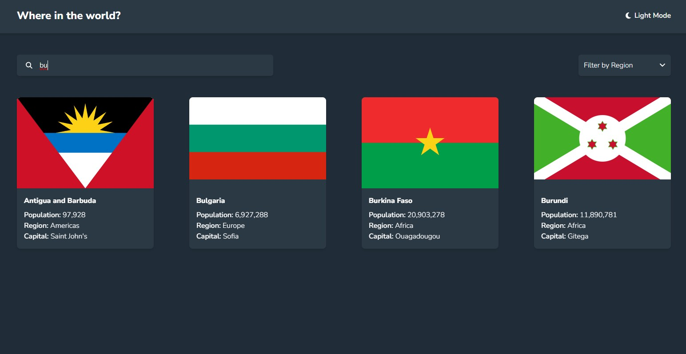

# Frontend Mentor - REST Countries API with color theme switcher solution

This is a solution to the [REST Countries API with color theme switcher challenge on Frontend Mentor](https://www.frontendmentor.io/challenges/rest-countries-api-with-color-theme-switcher-5cacc469fec04111f7b848ca). Frontend Mentor challenges help you improve your coding skills by building realistic projects. 

## Table of contents

- [Frontend Mentor - REST Countries API with color theme switcher solution](#frontend-mentor---rest-countries-api-with-color-theme-switcher-solution)
  - [Table of contents](#table-of-contents)
  - [Overview](#overview)
    - [The challenge](#the-challenge)
    - [Screenshot](#screenshot)
    - [Links](#links)
  - [My process](#my-process)
    - [Built with](#built-with)
    - [What I learned](#what-i-learned)
    - [Useful resources](#useful-resources)
  - [Author](#author)

## Overview

### The challenge

Users should be able to:

- See all countries from the API on the homepage
- Search for a country using an `input` field
- Filter countries by region
- Click on a country to see more detailed information on a separate page
- Click through to the border countries on the detail page
- Toggle the color scheme between light and dark mode *(optional)*

### Screenshot

### Links

- Live Site URL: [https://dynamic-liger-46b72b.netlify.app/](https://dynamic-liger-46b72b.netlify.app/)

## My process

### Built with

- Tailwind
- CSS Grid
- [React](https://reactjs.org/) - JS library
- [Gatsby](https://www.gatsbyjs.com/) - React framework

### What I learned

Gatsby is a React-based tool that can be used to build static sites. Gatsby can generate a static site by reading data from an internal GraphQL database. There are several source plugins available that can populate data into Gatsby's GraphQL database. You may also write your own source plugin.

### Useful resources

- [Gatsby Creating a Source Plugin](https://www.gatsbyjs.com/docs/tutorial/creating-a-source-plugin/) - This article helped me create a custom Gatsby Source Plugin to read from the REST coutries API

## Author

- Website - [Jeffrey Yan](https://precious-dasik-f097e8.netlify.app/)
- Frontend Mentor - [@jeff2266](https://www.frontendmentor.io/profile/jeff2266)
